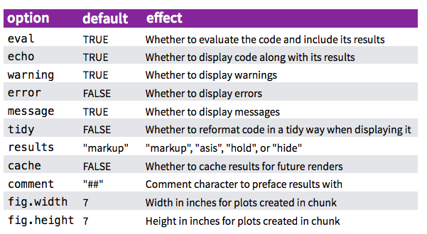

## Load and install packages
Step 1 :
```{r, echo=T, results='hide'}
install.packages("pacman",repos = "http://cran.us.r-project.org")
```

Step 2 :
```{r}
pacman::p_load("tidyverse", "data.table", "knitr", "roxygen2", "DT", "htmlwidgets", "readxl",
               "xaringan","tufte", "fivethirtyeight","socviz","infer","tinytex", "here"
               , install=TRUE)
```
Note the `install=TRUE` argument which makes it install packages that are not already installed and just load packages already installed.

## Code chunks
Code chunks is where you write your R code. The following options can be added to define what's to be shown:





## Create (interactive) tables {.tabset}
```{r, echo=F}
tabledata=data.frame(ID=c(1:9),outcomes=c("be confident using the RStudio environment","be able to install and use libraries","be able to perform basic coding","know how to create and use data","know how to import and export data","be able to manipulate basic data","be able to summarize data and perform descriptive statistics","be able to perform basic data visualisation","gain hands-on experience of working in R"))
```

### Simple table {.tabset}
```{r}
knitr::kable(tabledata)
```

### Interactive table
```{r}
DT::datatable(tabledata, options = list(pageLength = 5))
```


## On R objects 

**data types** VS **data structures**

### Objects classes {.tabset}

An **atomic vector** can only be composed of elements of the same data type. A **dataframe** can only contain atomic vectors of the same length. A **list** can contain anything. **Tibbles** then are the didyverse version of dataframes (they share a lot of properties).

To know the class of object x, there's a function: `class(x)`.

#### Vectors
Let's use `seq()` and `rep()` to generate vectors:
```{r}
a <- seq(from=1,to=10,by=2)
b <- rep(1,10)
```

##### Vectors functions
`length(x)` returns the number of elements in the vector x and `nchar(x)` counts the # of characters for each element in x. It's output is a vector of the same length.

```{r}
x <- c("hello","goodbye",NA)
length(x)
nchar(x) 
"goodbye" %in% x 
```
##### Vectors subsetting and NAs

Say we want to filter out the elements of x that do not contain 5 characters. We might go for:
```{r}
(x <- x[nchar(x)==5])
```
Beware that NAs are still included unless they are filtered out explicitly:
```{r}
(x[nchar(x)==5 & (!is.na(x))]) 
```


#### Dataframes
```{r}
df = data.frame(
  ID = 1:6,
  trivial = c("this","training","is", "too","long",NA)
  )

names(df) # lists the variable names. Equivalent: colnames()
rownames(df) # returns the id values
```

See a dataframe as a combination of observations i and columns j such that df[i,j].

#### Tibbles
Tibbles are the tidyverse dataframes. The way they should be subseted is the same. We can use the function `as_tibble()` to convert a dataframe into a tibble.

```{r}
(as_tibble(df)) # converts df in a tibble
```

#### Lists
Let's create a list:
```{r}
L <- list(employee="Paul", role="Data Scientist", age=34, projects=c("ING","Danone"))
class(L)
str(L)
```

3 different ways to access the elements of a list:
```{r}
L[["role"]]
L[[2]]
L$role # only works if the list's elements have names!
```
Note that the output of R statistical functions (e.g. linear models' coefficients) is often stored in a list.

When storing other lists/vectors/df, it should be accesses in a hierarchical way:
```{r}
(L2 <- list(L,df))
L2[[1]]
L2[[1]][2] # or its equivalents L2[[1]]$role and L2[[1]][["role"]]
```


## Data tidying {.tabset}

Tidy datasets are easy to manipulate, model and visualise, and have a specific structure:
each variable is a column, each observation is a row, and each type of observational unit is a table. See <https://vita.had.co.nz/papers/tidy-data.pdf> for a more complete discussion.

### gather()

The option `gather()` makes it easy to convert datasets from a wide to a long format:

`gather(<data>, <original columns names> ,key = <New column name>, value = <name of variable containing values>)`
```{r}
knitr::kable(table4a)
table4a %>% 
  tidyr::gather("1999","2000",key="year",value="nrcases") 
```

### spread()

At the opposite, `spread()` can be used to convert datasets from a long to a wide format. Its syntax is:

`spread( <data>, key= <variable who has the values you want to send to columns>, value = variable currently containing the values`

```{r}
table2
table2 %>% 
  spread(key=year,value=count)
```

### Remark
Watch out: `gather()` is not the perfect reverse of `spread()` data types are lost by default (columns gathered to variable values are of data type char by default). To avoid that, use the *convert=TRUE* argument in the `spread()` function.
```{r}
(stocks <- tibble(
  year=c(2015,2015,2016,2016),
  half=c(1,2,1,2),
  return=c(1.88,0.5,0.92,0.17)
))

stocks %>%
  spread(year,return) %>%
  gather("year","return",'2015','2016')
```

## Dataset exploration {.tabset}

```{r}
load(here("Data","ncbikecrash.Rdata")) 
```

Nice functions to explore a tibble are:

### names()
```{r}
names(ncbikecrash)
```
### glimpse()
```{r}
glimpse(ncbikecrash)
```
### head()/tail()
```{r}
head(ncbikecrash) # similarly, tail(ncbikecrash) would display the tail of the dataset
```

## Summarizing and sampling data {.tabset}
### filter() and select()
```{r}
ncbikecrash %>% 
  filter(county == "Durham", bike_age_group == "0-5") %>%
  select(locality,speed_limit)
```
Note: Use **pull()** instead of **select()** to extract the values only (not as a new tibble). Use **order()** to reorder the variables and **arange()** to sort observations.

### distinct()

The tidyverse equivalent to the SQL query

`SELECT DISTINCT county`

`FROM ncbikecrash` is:
```{r}
ncbikecrash %>%
  distinct(county) 
```

### count() 
A tidyverse equivalent to:

`SELECT COUNT(*) as [Number of cases]`

`FROM ncbikecrash` 

`GROUP BY driver_alcohol_drugs` is:
```{r}
ncbikecrash %>%
  group_by(driver_alcohol_drugs) %>%
  summarize("Number of cases"=n())
```
or its shortcut:
```{r}
ncbikecrash %>%
  count(driver_alcohol_drugs)
```

### sample_frac()
Use `sample_frac()` to get a random sample of a dataset. The second argument specifies the % of the original dataset that you're including in the sample.
```{r}
ncbikecrash %>%
  sample_frac(0.2, replace=F) %>%
  head()
```

## Create new variables

`mutate()` can be used to modify variables or to create new ones.
```{r}
ncbikecrash %>%
  mutate(
    dad_simplified = case_when(
      driver_alcohol_drugs == "Missing" ~ NA_character_,
      str_detect(driver_alcohol_drugs, "Yes") ~ "Yes", # equivalent to driver_alcohol_drugs like '%Yes%'
      TRUE ~ "No" # else "No"
    )
  ) %>%
  count(dad_simplified)
```
